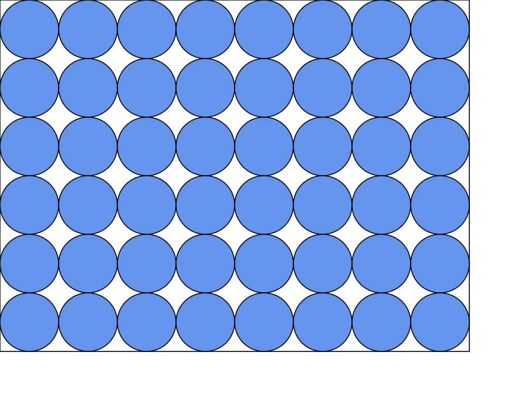
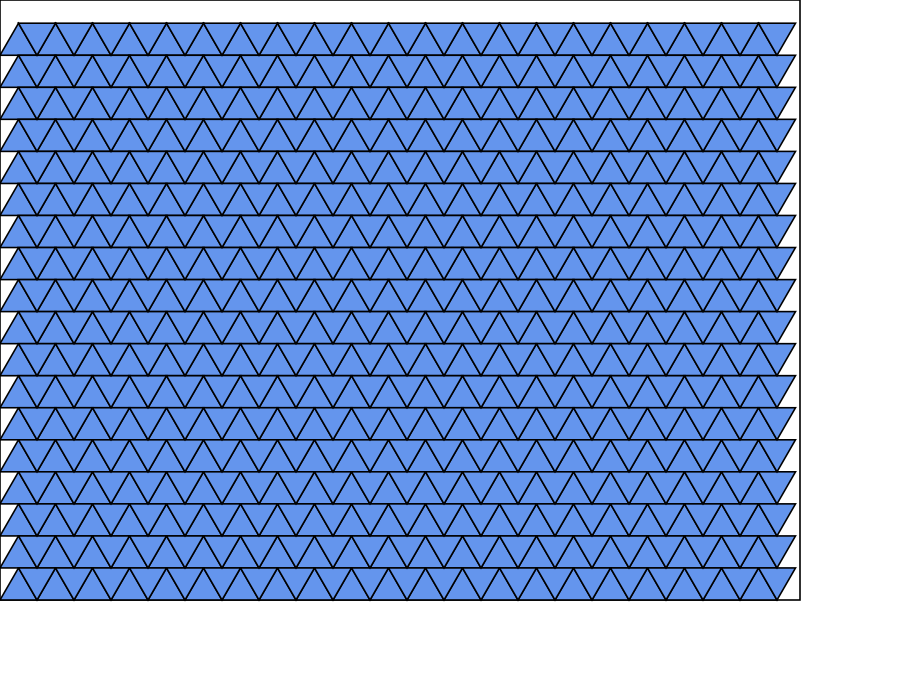
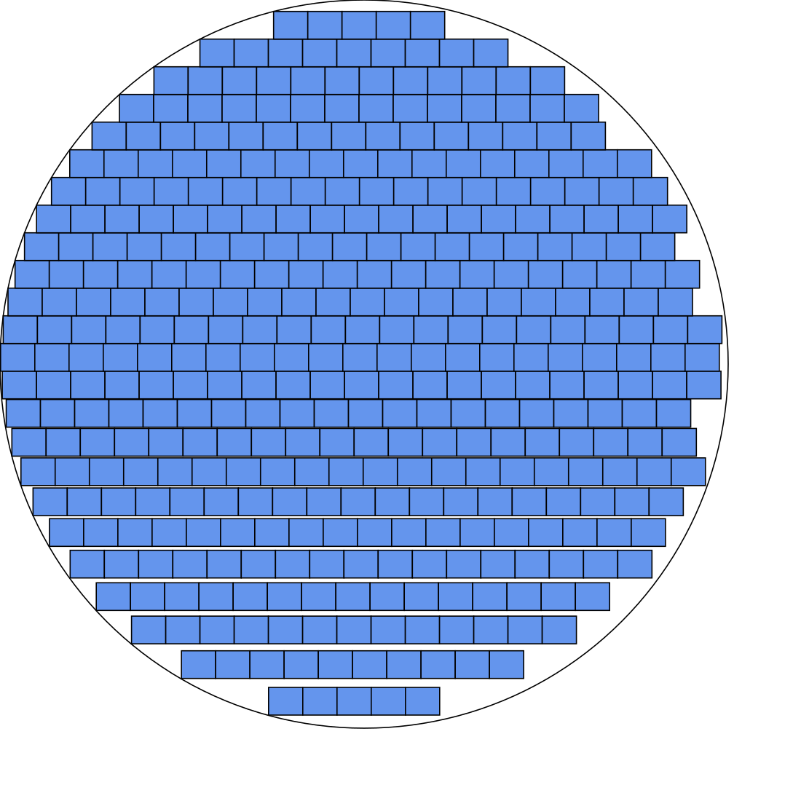
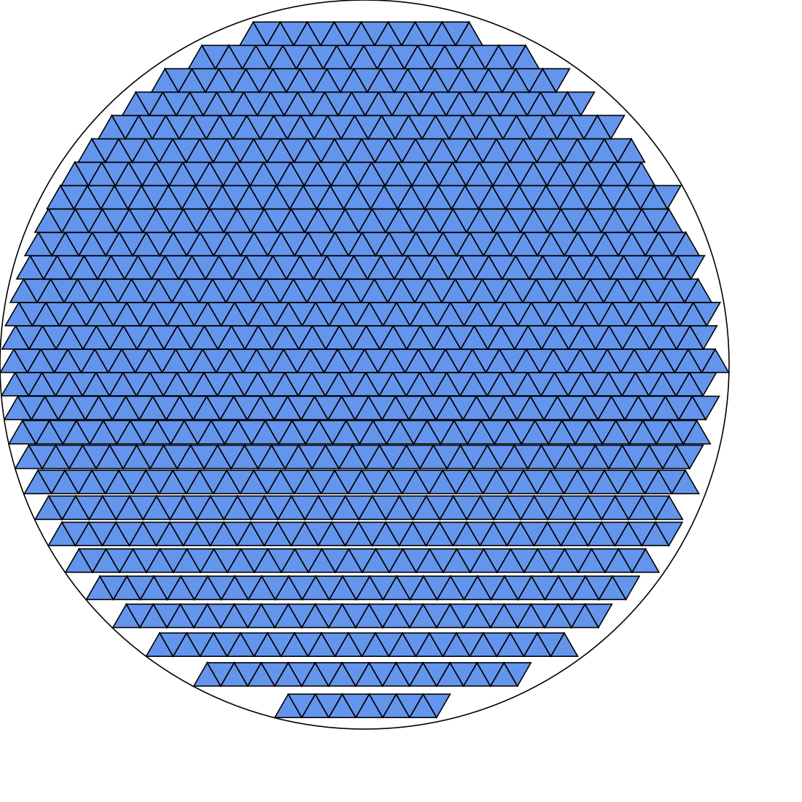
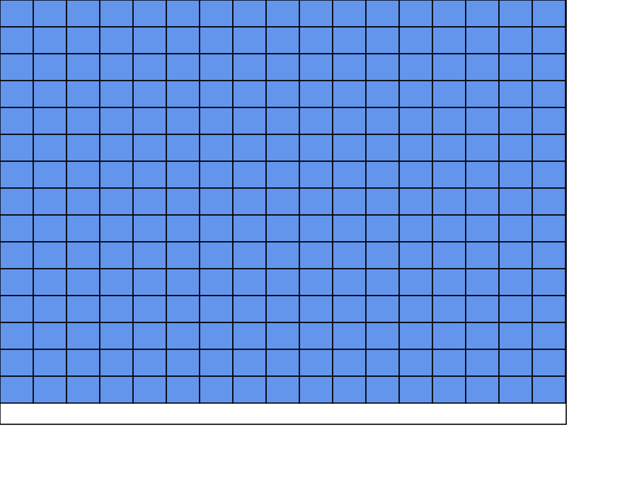
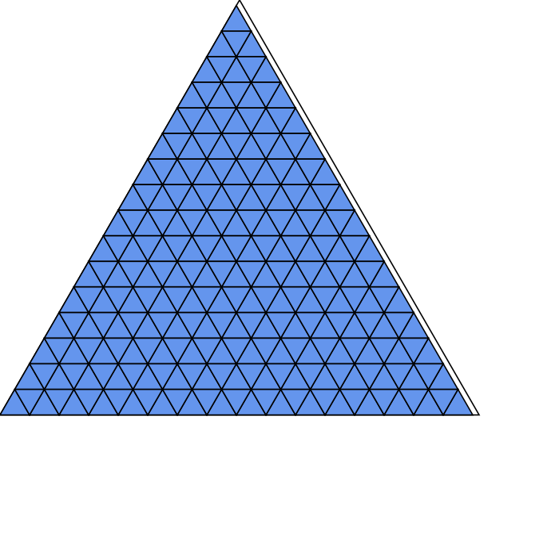
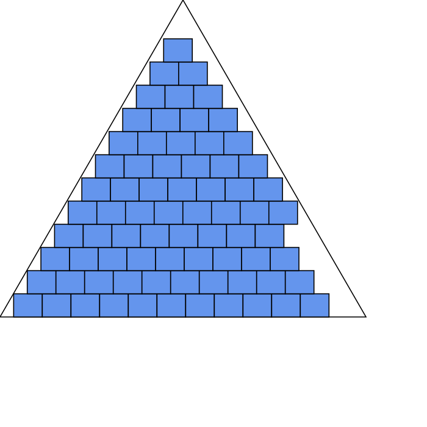
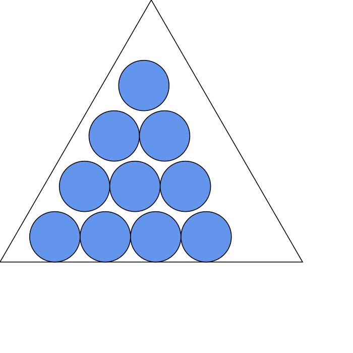
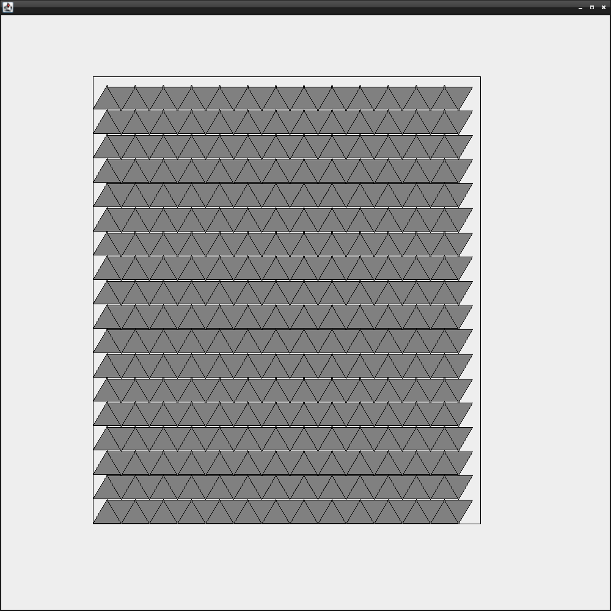
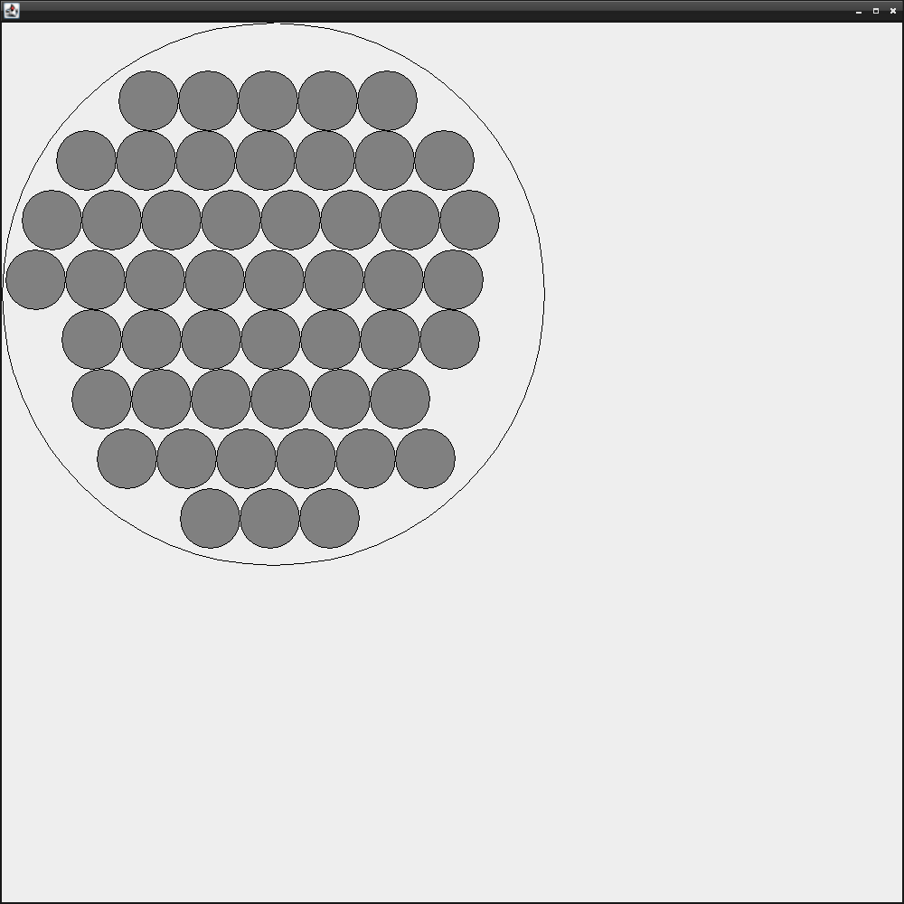

# Packing-Library-C++/Java

C++ and Java program that will optimize some 2D shapes and produce SVG (Scalable Vector Graphics) files to display calculated 2D graphics.

Java Implementation designed on top of GUI, some examples :

